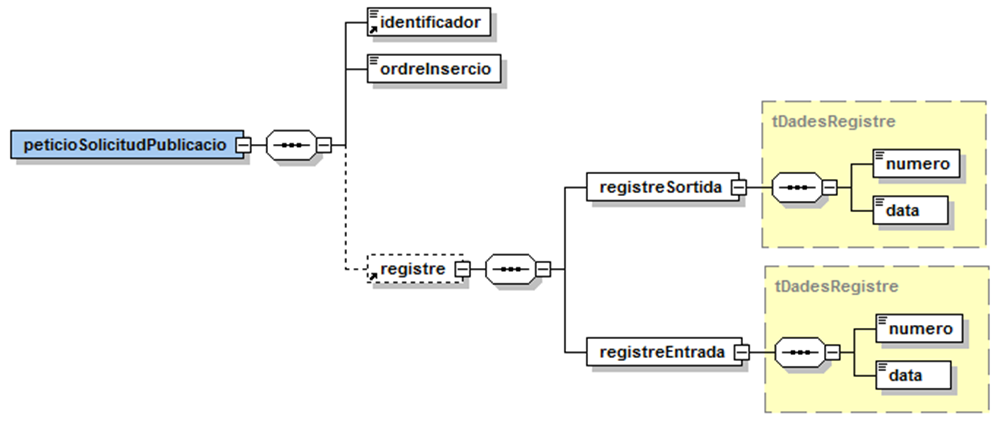
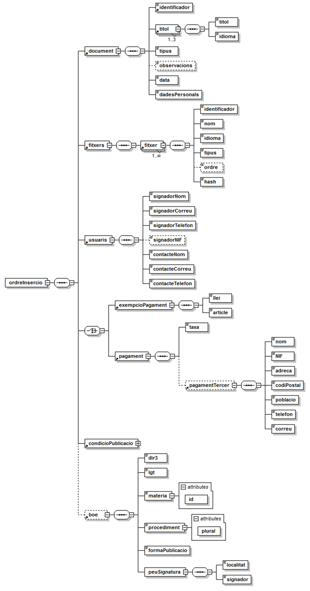
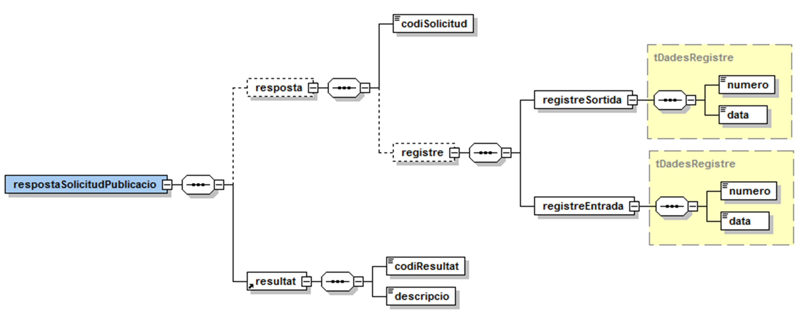
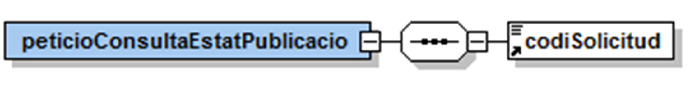
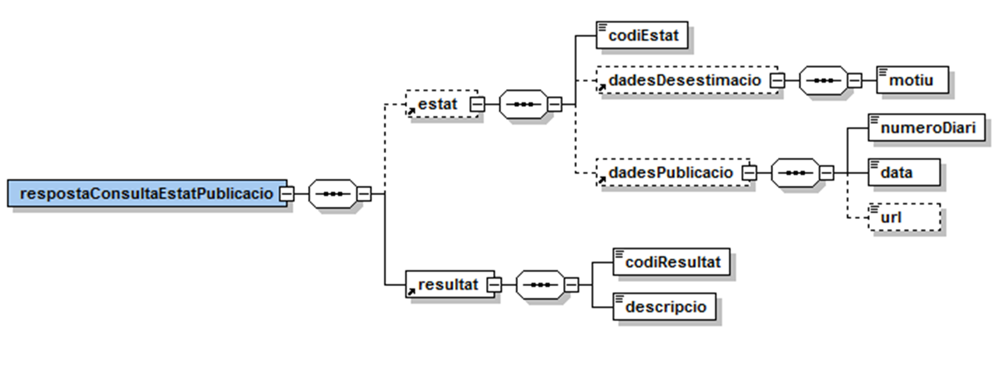
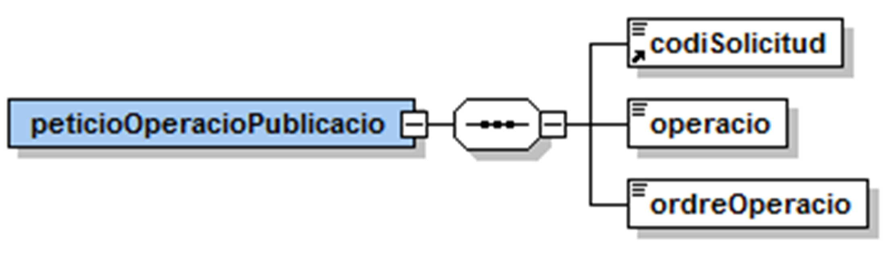
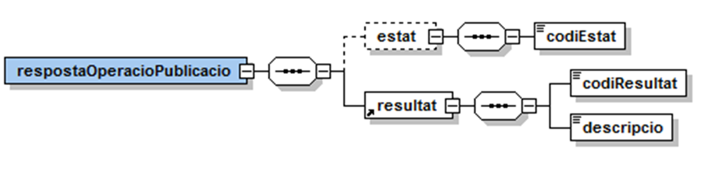

Documentació d'integració del servei DOGC del Consorci AOC.

**Control del document**

**Informació general**

| **Títol:** | Diari Oficial de la Generalitat de Catalunya. Document d&#39;integració del servei |
| --- | --- |
| **Creat per:** | Departament d&#39;Operacions – Unitat de Projectes |
| **A revisar per:** | Departament d&#39;Operacions – Suport a Integracions |
| **A aprovar per:** | Departament d&#39;Operacions – Suport a Integracions |
| **Llista de distribució:** |
| **Nom del document:** | DI - DOGC.doc |

**Històric de revisions**

| **Versió** | **Data** | **Autor** | **Comentaris** |
| --- | --- | --- | --- |
| V1.0 | 18/06/2012 | Roger Noguera i Arnau | Creació del document. |
| V1.1 | 02/04/2014 | Roger Noguera i Arnau | Adaptació a canvis en els serveis del DOGC |
| V2.0 | 18/07/2016 | Roger Noguera i Arnau | Suport de publicació al TEU del BOE via DOGC. |

# **Índex** #

1. Introducció
2. Transmissions de dades disponibles
3. Missatgeria del servei
   1. Sol·licitud de publicació
      1. Petició – dades específiques
      2. Petició – dades genèriques
      3. Resposta – dades específiques
   2. Consulta d&#39;estat
      1. Petició – dades específiques
      2. Resposta – dades específiques
   3. Operacions sobre una publicació
      1. Petició – dades específiques
      2. Resposta – dades específiques

# 1 Introducció

Aquest document detalla la missatgeria associada al servei de publicació del Diari Oficial de la Generalitat de Catalunya (en endavant DOGC).

Per poder realitzar la integració cal conèixer prèviament la següent documentació:

- Document d&#39;_Especificació de missatgeria pel consum de productes de la plataforma PCI_ del Consorci AOC.

# 2 Transmissions de dades disponibles

Les operacions disponibles a través del servei són les que es presenten a continuació:

| **EMISSOR** |
| --- |
| DOGC (Diari Oficial de la Generalitat de Catalunya) |
| **PRODUCTE** | **MODALITAT** | **DESCRIPCIO** |
| **DOGC** | DOGC | Operacions del servei de publicació del DOGC:

- Sol·licitud de publicació i càrrega de fitxers
- Consulta d&#39;estat d&#39;una publicació
- Realitzar operacions sobre una publicació

# 3 Missatgeria del servei

A continuació es detalla la missatgeria corresponent al bloc de dades específiques de les diferents operacions del servei.

L&#39;organisme que realitza la publicació s&#39;identifica en l&#39;element de la missatgeria genèrica DatosAutorizacion/IdentificadorSolicitante.
 En cas que la integració es realitzi via una plataforma intermediària – **com en el cas de la PCSP** - caldrà informar el codi INE10 de l&#39;organisme emissor del document a l&#39;element IdSolicitanteOriginal.

## 3.1 Sol·licitud de publicació

### 3.1.1 Petició – dades específiques

| _Element_ | _Descripció_ |
| --- | --- |
 //peticioSolicitudPublicacio/identificador | Codi de document del sistema origen (únic).
 //peticioSolicitudPublicacio/ordreInsercio | XML codificat en Base64 amb la informació del document a publicar. L&#39;ordre d&#39;inserció ha d&#39;estar signada en format XAdES-BES (signatura bàsica, _enveloped_) emprant un certificat de signatura reconeguda (nivell 4). En el cas d&#39;EACAT l&#39;ordre d&#39;inserció no estarà signada i la signatura s&#39;enviarà en un fitxer a banda de tipus signatura (tipus 4). En aquest cas el format de la signatura serà CAdES. Per més detalls sobre l&#39;estructura del XML consulteu l&#39;apartat 3.1.1.1 d&#39;aquest document.
 //peticioSolicitudPublicacio/registre | Bloc de dades corresponent a la informació de registre. Només s&#39;ha d&#39;informar quan la petició procedeix d&#39;EACAT. Per a la resta de sistemes els assentaments es realitzaran automàticament.
//registre/registreSortida/numero|Número d&#39;assentament de sortida de l&#39;organisme.
//registre/registreSortida/data|Data d&#39;assentament de sortida de l&#39;organisme.
//registre/registreEntrada/numero|Número d&#39;assentament d&#39;entrada a l&#39;EADOP.
//registre/registreEntrada/data|Data d&#39;assentament d&#39;entrada a l&#39;EADOP.

#### 3.1.1.1 Ordre d&#39;inserció

El DOGC requereix que tota operació relacionada amb una publicació vagi acompanyada d&#39;un XML signat emprant un certificat de signatura reconeguda (nivell 4) amb les dades de la sol·licitud de publicació.

| _Element_ | _Descripció_ |
| --- | --- |
//ordreInsercio/document | Bloc de dades corresponent al document a publicar.
//document/identificador | Codi de document del sistema origen (el mateix que s&#39;informa a l&#39;element peticioSolicitudPublicacio /identificador). Pels serveis externs a EACAT, aquest identificador haurà de tenir un prefix que identifiqui el servei d&#39;origen. Cal acordar amb el Consorci AOC el prefix que cada requeridor ha d&#39;emprar.
//document/titol | Títol del document. Com a mínim s&#39;ha d&#39;informar un títol (en català o castellà).
//document/idioma | Codi d&#39;idioma:<ul><li>ca\_es: català</li><li>es: castellà</li><li>oc\_es: aranès</li></ul>
//document/tipus | Tipus de document:<ul><li>009: Resolució</li><li>010: Circular</li><li>011: Edicte</li><li>012: Anunci</li><li>013: Decret de l&#39;Administració local</li><li>015: Correcció d&#39;errades</li><li>018: Instrucció</li><li>019: Acord</li><li>140: Dictamen</li><li>150: Ordenança municipal</li></ul>
//document/observacions | Observacions de l&#39;usuari que publica.
//document/data | Data del document a publicar.
//document/dadesPersonals | Indica si el document conté dades de caràcter personal (S / N).
//ordreInsercio/fitxers | Bloc de dades corresponent als fitxers a publicar.
//ordreInsercio/fitxers/fitxer | Bloc de dades corresponent a un fitxer a publicar.
//fitxer/identificador | Identificador de document. Únic en la petició. Per identificar cada adjunt, caldrà alinear l&#39;atribut Fichero@Id del bloc de dades genèriques amb l&#39;element identificador de cadascun dels document informats a les dades específiques de la sol·licitud. En cas de transferència de fitxers adjunts seguint l&#39;estàndard MTOM, cal informar els adjunts en l&#39;element Contenido del bloc de dades genèriques Ficheros destinat a aquest efecte. La grandària màxima de fitxer suportada són 10MB.
//fitxer/nom | Nom del fitxer. El nom del fitxer no es pot repetir en la mateixa ordre d&#39;inserció. Només s&#39;accepten caràcters alfanumèrics (sense accents) i els caràcters &#39;.&#39;, &#39;-&#39;, &#39;\_&#39; i &#39; &#39;.
//fitxer/idioma | Codi d&#39;idioma:<ul><li>ca\_es: català</li><li>es: castellà</li><li>oc\_es: aranès</li></ul>
//fitxer/tipus | Tipus de fitxer:<ul><li>1: Principal (.doc, .docx i .rtf)</li><li>2: Annex (.doc, .docx i .rtf)</li><li>3: Imatges i PDFs (.pdf, .jpg. tiff)</li><li>4: Fitxer signatura si la petició procedeix d&#39;EACAT.</li></ul>
//fitxer/ordre | Ordre en que es publicaran els annexos al final del document principal. Obligatori pel tipus de fitxers annex (2).
//fitxer/hash | Resum criptogràfic del fitxer adjunt (SHA-1).
//ordreInsercio/usuaris | Bloc de dades corresponent a les dades de l&#39;usuari que signa la sol·licitud i el contacte.
//usuaris/signadorNom | Nom de l&#39;usuari que signa la sol·licitud.
//usuaris/signadorCorreu | Correu de l&#39;usuari que signa la sol·licitud.
//usuaris/signadorTelefon | Telèfon de l&#39;usuari que signa la sol·licitud.
//usuaris/signadorNIF | NIF de l&#39;usuari que signa la sol·licitud. |
//usuaris/contacteNom | Nom de l&#39;usuari de contacte.
//usuaris/contacteCorreu | Correu de l&#39;usuari de contacte.
//usuaris/contacteTelefon | Telèfon de l&#39;usuari de contacte.
//ordreInsercio/exempcioPagament | Bloc de dades corresponent a la informació de d&#39;exempció de pagament. Cal informar-lo quan l&#39;usuari sol·licita publicar un anunci gratuït.
//exempcioPagament/lleiExempcio | Identificació de la llei que regula l&#39;exempció del pagament.
//exempcioPagament/articleExempcio | Identificació de l&#39;article que regula l&#39;exempció del pagament.
//ordreInsercio/pagament | Bloc de dades corresponent a la informació de pagament.
//pagament/taxa | Taxa aplicada: <ul><li>1: taxa normal.</li><li>2: taxa urgent.</li></ul>
//pagament/pagamentTercer | Bloc de dades corresponent a la informació de pagament quan el pagament va a càrrec d&#39;un tercer i no de l&#39;organisme que sol·licita la publicació.
//pagamentTercer/nom | Nom o raó social del pagador. 
//pagamentTercer/NIF | NIF del pagador. 
//pagamentTercer/adreca | Adreça del pagador. 
//pagamentTercer/codiPostal | Codi postal del pagador. 
//pagamentTercer/poblacio | Població del pagador. 
//pagamentTercer/telefon | Telèfon del pagador. 
//pagamentTercer/correu | Correu electrònic del pagador. 
//ordreInsercio/condicioPublicacio | Bloc de dades corresponent a les condicions de publicació del document. Per més detalls sobre les condicions de publicació admeses en base al mode de pagament consulteu l&#39;apartat 3.1.1.2 d&#39;aquest document.
//condicioPublicacio/condicio | Condició de publicació:<ul><li>0: en qualsevol data</li><li>1: urgent (només disponible si està exempt de pagament</li><li>2: data concreta (segons element data)</li><li>3: no abans de la data de publicació especificada (a l&#39;element data)</li><li>4: juntament amb un altre document (identificat per identificadorRelacionat)</li><li>5: després d&#39;un altre document (identificat per identificadorRelacionat)</li></ul>
//condicioPublicacio/identificadorRelacionat | Identificador del document en el sistema origen relacionat. EACAT no realitzarà cap tipus de validació d&#39;existència de les publicacions referenciades.
//condicioPublicacio/data | Data de condició de publicació.
//boe | Bloc de dades corresponent a la informació específica de publicació al BOE, en cas que també es vulgui publicar l&#39;anunci al Tablón Edictal Único.
//boe/dir3 |
//boe/lgt | S si l&#39;anunci s&#39;ha de publicar conforme el disposat a l&#39;article 112 de la Ley 58/2003 (Ley General Tributaria).
//boe/materia | Matèria. Vegeu annex Matèries BOE.
//boe/materia@id | Identificador de matèria. Vegeu annex Matèries BOE.
//boe/procediment | Text lliure que permet construir de manera automatitzada el títol de l&#39;anunci BOE. No ha de contenir dades de caràcter personal. El títol generat tindrà el següent format: [entitat emisora]. Anuncio de notificación de [data] en procedimiento[s] [procediment]. L&#39;atribut plural (S/N) indicarà si cal emprar-se el plural en la paraula procediment. La data que s&#39;emprarà a l&#39;hora de composar el títol de l&#39;anunci és la informada a //document/data.
//boe/procediment@plural |
//boe/formaPublicacio | Forma de publicació:<ul><li>E: extracte</li><li>I: Íntegra</li></ul>
/vboe/peuSignatura/localitat | Població on té lloc la signatura.
//boe/peuSignatura/signador | Càrrec i nom i dos cognoms del signatari. En els casos d&#39;actuació administrativa automatitzada pot consistir únicament en la identificació de l&#39;organisme o unitat signatària. En cas d&#39;alteració de la competència caldrà incloure les referències corresponents.

#### 3.1.1.2 Condicions de publicació en base al mode de pagament

| _Exempció pagament_ | _Taxa pagament_ | _Condicions de publicació admeses_ |
| --- | --- | --- |
SI | N/A |<ul><li>0: en qualsevol data</li><li>1: urgent</li><li>2: data concreta (segons element data)</li><li>3: no abans de la data de publicació especificada (a l&#39;element data)</li></ul>
NO | 1: taxa normal |<ul><li>0: en qualsevol data</li><li>2: data concreta (segons element data)</li><li>3: no abans de la data de publicació especificada (a l&#39;element data)</li></ul>
NO | 2: taxa urgent |1: urgent (només disponible si està exempt de pagament

_Ordre d&#39;insercio signada (exemple)_
| --- |
\&lt;ordreInsercio xmlns=&quot;http://www.aoc.cat/dogc&quot;\&gt; \&lt;document\&gt; \&lt;identificador\&gt;ID-1\&lt;/identificador\&gt; \&lt;titol\&gt; \&lt;titol\&gt;Títol en català\&lt;/titol\&gt; \&lt;idioma\&gt;ca\_es\&lt;/idioma\&gt; \&lt;/titol\&gt; \&lt;tipus\&gt;009\&lt;/tipus\&gt; \&lt;observacions\&gt;Observacions\&lt;/observacions\&gt; \&lt;data\&gt;2012-08-08\&lt;/data\&gt; \&lt;dadesPersonals\&gt;N\&lt;/dadesPersonals\&gt; \&lt;/document\&gt; \&lt;fitxers\&gt; \&lt;fitxer\&gt; \&lt;identificador\&gt;fitxer-1\&lt;/identificador\&gt; \&lt;nom\&gt;principal.doc\&lt;/nom\&gt; \&lt;idioma\&gt;ca\_es\&lt;/idioma\&gt; \&lt;tipus\&gt;1\&lt;/tipus\&gt; \&lt;hash\&gt;dsdasad=\&lt;/hash\&gt; \&lt;/fitxer\&gt; \&lt;fitxer\&gt; \&lt;identificador\&gt;fitxer-2\&lt;/identificador\&gt; \&lt;nom\&gt;annex1.doc\&lt;/nom\&gt; \&lt;idioma\&gt;ca\_es\&lt;/idioma\&gt; \&lt;tipus\&gt;2\&lt;/tipus\&gt; \&lt;ordre\&gt;1\&lt;/ordre\&gt; \&lt;hash\&gt;dsdasad=\&lt;/hash\&gt; \&lt;/fitxer\&gt; \&lt;fitxer\&gt; \&lt;identificador\&gt;fitxer-3\&lt;/identificador\&gt; \&lt;nom\&gt;annex2.doc\&lt;/nom\&gt; \&lt;idioma\&gt;ca\_es\&lt;/idioma\&gt; \&lt;tipus\&gt;2\&lt;/tipus\&gt; \&lt;ordre\&gt;2\&lt;/ordre\&gt; \&lt;hash\&gt;dsdasad=\&lt;/hash\&gt; \&lt;/fitxer\&gt; \&lt;fitxer\&gt; \&lt;identificador\&gt;fitxer-4\&lt;/identificador\&gt; \&lt;nom\&gt;imatge.jpg\&lt;/nom\&gt; \&lt;idioma\&gt;ca\_es\&lt;/idioma\&gt; \&lt;tipus\&gt;3\&lt;/tipus\&gt; \&lt;hash\&gt;dsdasad=\&lt;/hash\&gt; \&lt;/fitxer\&gt; \&lt;fitxer\&gt; \&lt;identificador\&gt;fitxer-5\&lt;/identificador\&gt; \&lt;nom\&gt;pdf.pdf\&lt;/nom\&gt; \&lt;idioma\&gt;ca\_es\&lt;/idioma\&gt; \&lt;tipus\&gt;3\&lt;/tipus\&gt; \&lt;hash\&gt;dsdasad=\&lt;/hash\&gt; \&lt;/fitxer\&gt; \&lt;/fitxers\&gt; \&lt;usuaris\&gt; \&lt;signadorNom\&gt;Usuari signador\&lt;/signadorNom\&gt; \&lt;signadorCorreu\&gt;rnoguera@aoc.cat\&lt;/signadorCorreu\&gt; \&lt;signadorTelefon\&gt;935555555\&lt;/signadorTelefon\&gt; \&lt;signadorNIF\&gt;11111111H\&lt;/signadorNIF\&gt; \&lt;contacteNom\&gt;Usuari contacte\&lt;/contacteNom\&gt; \&lt;contacteCorreu\&gt;rnoguera@aoc.cat\&lt;/contacteCorreu\&gt; \&lt;contacteTelefon\&gt;935555555\&lt;/contacteTelefon\&gt; \&lt;/usuaris\&gt; \&lt;exempcioPagament\&gt; \&lt;llei\&gt;Llei\&lt;/llei\&gt; \&lt;article\&gt;Article\&lt;/article\&gt; \&lt;/exempcioPagament\&gt; \&lt;condicioPublicacio\&gt; \&lt;condicio\&gt;0\&lt;/condicio\&gt; \&lt;/condicioPublicacio\&gt; \&lt;ds:Signature xmlns:ds=&quot;http://www.w3.org/2000/09/xmldsig#&quot; Id=&quot;Signature&quot;\&gt; \&lt;ds:SignedInfo Id=&quot;SignedInfo&quot;\&gt; \&lt;ds:CanonicalizationMethod Algorithm=&quot;http://www.w3.org/TR/2001/REC-xml-c14n-20010315&quot;/\&gt; \&lt;ds:SignatureMethod Algorithm=&quot;http://www.w3.org/2000/09/xmldsig#rsa-sha1&quot;/\&gt; \&lt;ds:Reference Id=&quot;SignedDataObject-enveloped&quot; URI=&quot;&quot;\&gt; \&lt;ds:Transforms\&gt; \&lt;ds:TransformAlgorithm=&quot;http://www.w3.org/2000/09/xmldsig#enveloped-signature&quot;/\&gt; \&lt;ds:TransformAlgorithm=&quot;http://www.w3.org/TR/2001/REC-xml-c14n-20010315&quot;/\&gt; \&lt;/ds:Transforms\&gt; \&lt;ds:DigestMethod Algorithm=&quot;http://www.w3.org/2000/09/xmldsig#sha1&quot;/\&gt; \&lt;ds:DigestValue\&gt;XYopNgTlR1RtxfwvyynUxZ3ZiO0=\&lt;/ds:DigestValue\&gt; \&lt;/ds:Reference\&gt; \&lt;ds:Reference Id=&quot;SignedProperties-Reference&quot; Type=&quot;http://uri.etsi.org/01903/v1.2.2#SignedProperties&quot; URI=&quot;#SignedProperties&quot;\&gt; \&lt;ds:DigestMethod Algorithm=&quot;http://www.w3.org/2000/09/xmldsig#sha1&quot;/\&gt; \&lt;ds:DigestValue\&gt;OLxDVVEwNJjGs5+STyKvIMXvMZ8=\&lt;/ds:DigestValue\&gt; \&lt;/ds:Reference\&gt; \&lt;/ds:SignedInfo\&gt; \&lt;ds:SignatureValue Id=&quot;DocumentSignatureValue&quot;\&gt;d65yEmuBrgfRLyNvC3SGHk0OKkzZPqFlqAByEFUIzeC8qK9SEGq/TN6IDu/nXQX1+Qgsn5eRiUNA(...)gY9vQBCmGYYPeaHTpxZQxpOCDyX6Pf9BtiPgKQ==\&lt;/ds:SignatureValue\&gt; \&lt;ds:KeyInfo Id=&quot;KeyInfo&quot;\&gt; \&lt;ds:X509Data\&gt; \&lt;ds:X509Certificate\&gt;MIIJIzCCCAugAwIBAgIQe+npPzpsnlNOZJA76B//lzANBgkqhkiG9w0BAQUFADCCATExCzAJBgNV(...)FgdCb7SaQuJzUFR6lXNmouGxdszz6KfGsnaISSmBzPndYfINJY8t9nddQ7nAU+Mcn8F7MEXUpsyvled9s2p7\&lt;/ds:X509Certificate\&gt; \&lt;/ds:X509Data\&gt; \&lt;ds:KeyValue\&gt; \&lt;ds:RSAKeyValue\&gt; \&lt;ds:Modulus\&gt;lINpwmN7jj2L+tljm9FIvhY4S6GuaoLsl4DlFFWiuHV/piQVc2BB2befITM1HYaFf208IWUo97sZ(...)WPHl7D/R47rTiKBwiRWmzSPhG/BB/Y+yb6NaZMpLy7dgz3b3cc51jSGi7ijp0KrQb/r8JlKir1wXEm2+0Jtn8EpeJgB0bTjwE1M2wdECf5Vy6N/EdQ==\&lt;/ds:Modulus\&gt; \&lt;ds:Exponent\&gt;AQAB\&lt;/ds:Exponent\&gt; \&lt;/ds:RSAKeyValue\&gt; \&lt;/ds:KeyValue\&gt; \&lt;/ds:KeyInfo\&gt; \&lt;ds:Object\&gt; \&lt;xades:QualifyingProperties xmlns:xades=&quot;http://uri.etsi.org/01903/v1.2.2#&quot; Id=&quot;QualifyingProperties&quot; Target=&quot;#Signature&quot;\&gt; \&lt;xades:SignedProperties Id=&quot;SignedProperties&quot;\&gt; \&lt;xades:SignedSignatureProperties\&gt; \&lt;xades:SigningTime\&gt;2012-08-14T11:58:42.848Z\&lt;/xades:SigningTime\&gt; \&lt;xades:SigningCertificate\&gt; \&lt;xades:Cert\&gt; \&lt;xades:CertDigest\&gt; \&lt;ds:DigestMethod Algorithm=&quot;http://www.w3.org/2000/09/xmldsig#sha1&quot;/\&gt; \&lt;ds:DigestValue\&gt;2C27TbSPoWPmSsmNj93SRmD6/bM=\&lt;/ds:DigestValue\&gt; \&lt;/xades:CertDigest\&gt; \&lt;xades:IssuerSerial\&gt; \&lt;ds:X509IssuerName\&gt;CN=EC-SAFP,OU=Secretaria d&#39;Administracio i Funcio Publica,OU=Vegeu https://www.catcert.net/verCIC-2 (c)03,OU=Serveis Publics de Certificacio ECV-2,L=Passatge de la Concepcio 11 08008 Barcelona,O=Agencia Catalana de Certificacio (NIF Q-0801176-I),C=ES\&lt;/ds:X509IssuerName\&gt; \&lt;ds:X509SerialNumber\&gt;164709579460476598671267166040352620439\&lt;/ds:X509SerialNumber\&gt; \&lt;/xades:IssuerSerial\&gt; \&lt;/xades:Cert\&gt; \&lt;/xades:SigningCertificate\&gt; \&lt;/xades:SignedSignatureProperties\&gt; \&lt;xades:SignedDataObjectProperties/\&gt; \&lt;/xades:SignedProperties\&gt; \&lt;/xades:QualifyingProperties\&gt; \&lt;/ds:Object\&gt;\&lt;/ds:Signature\&gt;\&lt;/ordreInsercio\&gt; |
| --- |

### 3.1.2 Petició – dades genèriques

#### Per cada document referenciat a la sol·licitud de publicació cal informar un bloc de dades //Ficheros/Fichero de les dades genèriques de la sol·licitud.

| _Element_ | _Descripció_ |
| --- | --- |
//Ficheros/Fichero/NombreFichero | Nom de l&#39;adjunt.
//Ficheros/Fichero/Contenido | Contingut del fitxer en cas de transferència per MTOM (en la crida correspon a la referència XOP del fitxer).
//Ficheros/Fichero/RutaFichero | Alternativa a Contenido, permet informa la ruta (ha de ser accessible per la plataforma PCI del CAOC) on es troba el fitxer.
//Ficheros/Fichero/Id | Identificador de fitxer únic en la petició i referenciat a l&#39;ordre d&#39;inserció.

### 3.1.3 Resposta – dades específiques

| _Element_ | _Descripció_ |
| --- | --- |
//respostaSolicitudPublicacio/resposta/codiSolicitud | Codi de sol·licitud retornat pel DOGC que identifica la publicació.
//respostaSolicitudPublicacio/resposta/registre | En cas que a la petició no s&#39;informin les dades de registre, retorna les dades dels assentaments fets per EACAT.
//registre/registreSortida/numero | Número d&#39;assentament de sortida de l&#39;organisme. |
//registre/registreSortida/data | Data d&#39;assentament de sortida de l&#39;organisme. |
//registre/registreEntrada/numero | Número d&#39;assentament d&#39;entrada a l&#39;EADOP. |
//registre/registreEntrada/data | Data d&#39;assentament d&#39;entrada a l&#39;EADOP. |
//respostaSolicitudPublicacio/resultat/codiResultat | Codi de resultat de l&#39;operació: <ul><li>0: publicació enviada correctament</li><li>1: manquen dades o alguna dada conté valors incorrectes</li><li>2: sol·licitud duplicada</li><li>502: error en el tractament de la publicació</li></ul>
//respostaSolicitudPublicacio/resultat/descripcio | Descripció del resultat.

## 3.2 Consulta d&#39;estat

### 3.2.1 Petició – dades específiques

| _Element_ | _Descripció_ |
| --- | --- |
//peticioConsultaEstatPublicacio/codiSolicitud | Codi de sol·licitud DOGC que identifica la publicació.

### 3.2.2 Resposta – dades específiques

| _Element_ | _Descripció_ |
| --- | --- |
//respostaConsultaEstatPublicacio/estat/codiEstat | Estat del document:<ul><li>0: En transferència</li><li>1: En curs</li><li>2: Finalitzada</li><li>3: Aturada</li><li>4: Pendent d&#39;aturar</li><li>5: Desistida</li><li>6: Pendent de desistir</li><li>7: Desestimada</li></ul>
//respostaConsultaEstatPublicacio/estat/dadesDesestimacio/motiu | En cas de estat Desestimada (7), motiu de la desestimació (el contingut es retorna dins d&#39;un CDATA).
//respostaConsultaEstatPublicacio/estat/dadesPublicacio/numeroDiari | En cas de Finalitzada (2), número del diari en que es publicarà el document.
//respostaConsultaEstatPublicacio/estat/dadesPublicacio/data | En cas de Finalitzada (2), data en que es publicarà el document (AAAAMMDD). |
//respostaConsultaEstatPublicacio/estat/dadesPublicacio/url | En cas de Finalitzada (2), URL on ha estat publicat el document, en cas que hagi estat publicat.
//respostaConsultaEstatPublicacio/resultat/codiResultat | Codi de resultat de la consulta:<ul><li>0: consulta realitzada correctament</li><li>502: error realitzant la consulta</li></ul>
/respostaConsultaEstatPublicacio/resultat/descripcio | Descripció del resultat de la consulta.

## 3.3 Operacions sobre una publicació

### 3.3.1 Petició – dades específiques

| _Element_ | _Descripció_ |
| --- | --- |
//peticioOperacioPublicacio/codiSolicitud | Codi de sol·licitud DOGC que identifica la publicació.
//peticioOperacioPublicacio/operacio | Codi d&#39;operació:<ul><li>2: Aturar publicació</li><li>3: Reprendre publicació</li><li>4: Desistiment de publicació</li></ul>
//peticioOperacioPublicacio/ordreOperacio | XML codificat en Base64 corresponent a l&#39;ordre de sol·licitud d&#39;operació sobre un determinat document. L&#39;ordre d&#39;inserció ha d&#39;estar signada en format XAdES-BES (signatura bàsica, _enveloped_) emprant un certificat de signatura reconeguda (nivell 4).

#### 3.3.1.1 Ordres signades de sol·licitud d&#39;operació

El DOGC requereix que tota operació relacionada amb una publicació vagi acompanyada d&#39;un XML signat en format XAdES-BES (signatura bàsica, _enveloped_) emprant un certificat de signatura reconeguda (nivell 4) amb un text on es sol·licita la operació.

Un exemple del text a signar és:

L&#39;usuari amb DNI \&lt;DNI\&gt; demana realitzar l&#39;operació (Atura publicació / Reprèn publicació / Desisteix publicació) sobre la sol.licitud de publicació al DOGC amb identificador \&lt;codiSolicitud DOGC\&gt;.

| _Ordre d&#39;operació signada (exemple)_ |
| --- |
\&lt;ordreOperacio xmlns=&quot;http://www.aoc.cat/dogc&quot;\&gt;\&lt;missatge\&gt;L&#39;usuari amb DNI 11111111H demana realitzar l&#39;operació Atura publicaciósobre la sol.licitud de publicació al DOGC amb identificador 10.145.006.\&lt;/missatge\&gt;\&lt;ds:Signature xmlns:ds=&quot;http://www.w3.org/2000/09/xmldsig#&quot; Id=&quot;Signature&quot;\&gt;\&lt;ds:SignedInfo Id=&quot;SignedInfo&quot;\&gt;\&lt;ds:CanonicalizationMethodAlgorithm=&quot;http://www.w3.org/TR/2001/REC-xml-c14n-20010315&quot;/\&gt;\&lt;ds:SignatureMethod Algorithm=&quot;http://www.w3.org/2000/09/xmldsig#rsa-sha1&quot;/\&gt;\&lt;ds:Reference Id=&quot;SignedDataObject-enveloped&quot; URI=&quot;&quot;\&gt;\&lt;ds:Transforms\&gt;\&lt;ds:Transform Algorithm=&quot;http://www.w3.org/2000/09/xmldsig#enveloped-signature&quot;/\&gt;\&lt;ds:Transform Algorithm=&quot;http://www.w3.org/TR/2001/REC-xml-c14n-20010315&quot;/\&gt;\&lt;/ds:Transforms\&gt;\&lt;ds:DigestMethod Algorithm=&quot;http://www.w3.org/2000/09/xmldsig#sha1&quot;/\&gt;\&lt;ds:DigestValue\&gt;TJKv76MFPS59Me/iPCDEMWAq4As=\&lt;/ds:DigestValue\&gt;\&lt;/ds:Reference\&gt;\&lt;ds:Reference Id=&quot;SignedProperties-Reference&quot;Type=&quot;http://uri.etsi.org/01903/v1.2.2#SignedProperties&quot; URI=&quot;#SignedProperties&quot;\&gt;\&lt;ds:DigestMethod Algorithm=&quot;http://www.w3.org/2000/09/xmldsig#sha1&quot;/\&gt;\&lt;ds:DigestValue\&gt;YMI9rXPH1XgWHUFoccQe9f9Rz54=\&lt;/ds:DigestValue\&gt;\&lt;/ds:Reference\&gt;\&lt;/ds:SignedInfo\&gt;\&lt;ds:SignatureValue Id=&quot;DocumentSignatureValue&quot;\&gt;NYkyv+0QH0onlad35S26ya0GW9/ojOWzxCHwpPQ1/+IJOHQJQ1joxeZfWjCJAFLDC4D6NNZfFlUV(. . .)UUd1IWXVtDsDzIIhZr7FQiHn311jn+hy1kfOYg==\&lt;/ds:SignatureValue\&gt;\&lt;ds:KeyInfo Id=&quot;KeyInfo&quot;\&gt;\&lt;ds:X509Data\&gt;\&lt;ds:X509Certificate\&gt;MIIJIzCCCAugAwIBAgIQe+npPzpsnlNOZJA76B//lzANBgkqhkiG9w0BAQUFADCCATExCzAJBgNVBAYTAkVTMTswOQYDVQQKEzJBZ2VuY2lhIENhdGFsYW5hIGRlIENlcnRpZmljYWNpbyAoTklGIFEt(. . .)FgdCb7SaQuJzUFR6lXNmouGxdszz6KfGsnaISSmBzPndYfINJY8t9nddQ7nAU+Mcn8F7MEXUpsyvled9s2p7\&lt;/ds:X509Certificate\&gt;\&lt;/ds:X509Data\&gt;\&lt;ds:KeyValue\&gt;\&lt;ds:RSAKeyValue\&gt;\&lt;ds:Modulus\&gt;lINpwmN7jj2L+tljm9FIvhY4S6GuaoLsl4DlFFWiuHV/piQVc2BB2befITM1HYaFf208IWUo97sZ(. . .)Em2+0Jtn8EpeJgB0bTjwE1M2wdECf5Vy6N/EdQ==\&lt;/ds:Modulus\&gt;\&lt;ds:Exponent\&gt;AQAB\&lt;/ds:Exponent\&gt;\&lt;/ds:RSAKeyValue\&gt;\&lt;/ds:KeyValue\&gt;\&lt;/ds:KeyInfo\&gt;\&lt;ds:Object\&gt;\&lt;xades:QualifyingProperties xmlns:xades=&quot;http://uri.etsi.org/01903/v1.2.2#&quot;Id=&quot;QualifyingProperties&quot; Target=&quot;#Signature&quot;\&gt;\&lt;xades:SignedProperties Id=&quot;SignedProperties&quot;\&gt;\&lt;xades:SignedSignatureProperties\&gt;\&lt;xades:SigningTime\&gt;2012-06-21T09:25:18.869Z\&lt;/xades:SigningTime\&gt;\&lt;xades:SigningCertificate\&gt;\&lt;xades:Cert\&gt;\&lt;xades:CertDigest\&gt;\&lt;ds:DigestMethod Algorithm=&quot;http://www.w3.org/2000/09/xmldsig#sha1&quot;/\&gt;\&lt;ds:DigestValue\&gt;2C27TbSPoWPmSsmNj93SRmD6/bM=\&lt;/ds:DigestValue\&gt;\&lt;/xades:CertDigest\&gt;\&lt;xades:IssuerSerial\&gt;\&lt;ds:X509IssuerName\&gt;CN=EC-SAFP,OU=Secretaria d&#39;Administracio i Funcio Publica,OU=Vegeu https://www.catcert.net/verCIC-2 (c)03,OU=Serveis Publics de Certificacio ECV-2,L=Passatge de la Concepcio 11 08008 Barcelona,O=Agencia Catalana de Certificacio (NIF Q-0801176-I),C=ES\&lt;/ds:X509IssuerName\&gt;\&lt;ds:X509SerialNumber\&gt;1647095(. . .)794604\&lt;/ds:X509SerialNumber\&gt;\&lt;/xades:IssuerSerial\&gt;\&lt;/xades:Cert\&gt;\&lt;/xades:SigningCertificate\&gt;\&lt;/xades:SignedSignatureProperties\&gt;\&lt;xades:SignedDataObjectProperties/\&gt;\&lt;/xades:SignedProperties\&gt;\&lt;/xades:QualifyingProperties\&gt;\&lt;/ds:Object\&gt;\&lt;/ds:Signature\&gt;\&lt;/ordreOperacio\&gt; |
| --- |

### 3.3.2 Resposta – dades específiques

| _Element_ | _Descripció_ |
| --- | --- |
//respostaOperacioPublicacio/estat/codiEstat | Codi d&#39;estat en que es troba la sol·licitud:<ul><li>1: En curs</li><li>2: Finalitzada</li><li>3: Aturada</li<li>4: Pendent d&#39;aturar</li><li>5: Desistida</li><li>6: Pendent de desistir</li><li>7: Desestimada</li></ul>
//peticioOperacioPublicacio/resultat/codiResultat | Codi de resultat de l&#39;operació:<ul><li>0: operació realitzada correctament</li><li>1: manquen dades o alguna dada conté valors incorrectes</li><li>3: codi de sol·licitud invàlida</li><li>4: fitxer de signatura invàlid</li><li>5: operació invàlida (p.e. no es pot aturar una sol·licitud ja aturada o reprendre una sol·licitud no aturada)</li><li>6: fitxers enviats no es poden processar</li><li>7: l&#39;operació ha d&#39;estar signada</li><li>502: error genèric realitzant l&#39;operació</li></ul>
//peticioOperacioPublicacio/resultat/descripcio | Descripció del resultat de la consulta.

**Annex – exemple de missatges**

Exemple de missatge amb el contingut del fitxer adjunts optimitzat seguint l&#39;estàndard MTOM (s&#39;obvien capçaleres HTTP i missatge SOAP).

| _Exemple petició_ |
| --- |
<Peticion xmlns="http://gencat.net/scsp/esquemes/peticion">
	<Atributos>
		<IdPeticion>CU1-DOGC-1331725182868</IdPeticion>
		<NumElementos>1</NumElementos>
		<TimeStamp/>
		<CodigoCertificado>DOGC</CodigoCertificado>
		<CodigoProducto>DOGC</CodigoProducto>
		<IdSolicitanteOriginal>9821920002</IdSolicitanteOriginal>
		<DatosAutorizacion>
			<IdentificadorSolicitante>9821920002</IdentificadorSolicitante>
			<NombreSolicitante>Consorci AOC</NombreSolicitante>
			<Finalidad>ADMINELEC</Finalidad>
		</DatosAutorizacion>
		<Funcionario>
			<NombreCompletoFuncionario>FUNCIONARI</NombreCompletoFuncionario>
			<NifFuncionario>NIF</NifFuncionario>
		</Funcionario>
	</Atributos>
	<Solicitudes>
		<SolicitudTransmision>
			<DatosGenericos>
				<Solicitante>
					<IdentificadorSolicitante>9821920002</IdentificadorSolicitante>
					<NombreSolicitante>Consorci AOC</NombreSolicitante>
					<Finalidad>ADMINELEC</Finalidad>
					<Consentimiento>Si</Consentimiento>
					<Funcionario>
						<NombreCompletoFuncionario>FUNCIONARI</NombreCompletoFuncionario>
						<NifFuncionario>NIF</NifFuncionario>
					</Funcionario>
				</Solicitante>
				<Transmision>
					<CodigoCertificado>DOGC</CodigoCertificado>
					<IdSolicitud>1</IdSolicitud>
					<IdTransmision>NUM EXPEDIENT</IdTransmision>
				</Transmision>
				<Ficheros>
					<Fichero>
						<NombreFichero>Anunci.doc</NombreFichero>
						<Contenido>
							<inc:Include href="cid:adjunt-dogc"
                        xmlns:inc="http://www.w3.org/2004/08/xop/include"/>
						</Contenido>
						<Id>1</Id>
						<Via>Entrada</Via>
					</Fichero>
				</Ficheros>
			</DatosGenericos>
			<DatosEspecificos>
				<peticioSolicitudPublicacio xmlns="http://www.aoc.cat/dogc/tramesa">
					<identificador>1</identificador>
					<ordreInsercio>
                 PG9yZHJlSW5zZXJjaW8geG1sbnMjYyMDQzOTwvZHMcm9wZXJ0aWVzPjwvZHM6T2JqZWN0Pgo8L
                 (. . .)
                 2RzOlNpZ25hdHVyZT48L29yZHJlSW5zZXJjaW8+
					</ordreInsercio>
				</peticioSolicitudPublicacio>
			</DatosEspecificos>
		</SolicitudTransmision>
	</Solicitudes>
</Peticion>

**Annex – matèries BOE**

_Codi_ | _Descripció_ |
| --- | --- |
1 | AGRICULTURA Y GANADERÍA
2 | AGUAS
3 | CATASTRO
4 | CAZA Y PESCA
5 | CONSUMO
6 | CREDITO, BANCA Y SEGUROS
7 | CULTURA Y ESPECTACULOS
8 | DEPORTES
9 | ECONOMIA Y COMERCIO
10 | EMPLEADOS PUBLICOS
11 | EMPLEO
12 | ENERGIA
13 | EDUCACION
14 | ENSEÑANZA UNIVERSITARIA
15 | ESTADISTICA
16 | EXPROPIACIONES
17 | EXTRANJERÍA
18 | FUERZAS ARMADAS
19 | HACIENDA
20 | INDUSTRIA Y ARTESANIA
21 | INSPECCION DE TRABAJO
22 | JUEGO
23 | MEDIO AMBIENTE Y SOSTENIBILIDAD
24 | METROLOGIA
25 | NAVEGACION AEREA
26 | NAVEGACION MARITIMA, PUERTOS Y MARINA MERCANTE
27 | NOTARIAS
28 | URBANISMO Y VIVIENDA
29 | PADRON MUNICIPAL
30 | PATRIMONIO Y PROPIEDADES PUBLICAS
31 | PROPIEDAD INTELECTUAL
32 | PROPIEDAD INDUSTRIAL
33 | PROTECCION DE DATOS DE CARÁCTER PERSONAL
34 | REGISTROS DE LA PROPIEDAD
35 | RESPONSABILIDAD PATRIMONIAL
36 | SANIDAD Y FARMACIA
37 | SEGURIDAD CIUDADANA Y PROTECCION CIVIL
38 | SEGURIDAD SOCIAL
39 | SERVICIOS FUNERARIOS
40 | SERVICIOS SOCIALES
41 | SUBVENCIONES, BECAS Y OTRAS AYUDAS
42 | TELECOMUNICACIONES Y NUEVAS TECNOLOGIAS
43 | TRAFICO, CIRCULACION Y SEGURIDAD VIAL
44 | TRANSPORTES TERRESTRES
45 | TURISMO
46 | OTRAS
47 | INSCRIPCIÓN, AFILIACIÓN Y RECAUDACIÓN DE LA SEGURIDAD SOCIAL